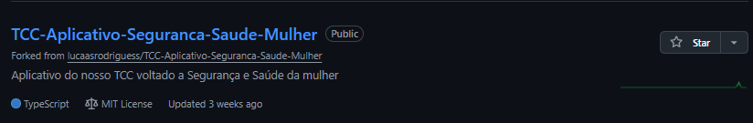
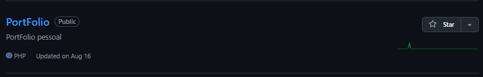

  

 

  <h1>Prazer 🙏 Eu sou Vagner</h1>

  

 <em>Estou atualmente focado em aprimorar minhas habilidades de desenvolvimento de software, explorando novas tecnologias e construindo uma base sólida. Sou apaixonado por criar soluções eficientes e inovadoras.</em>

 

<table align="center" border="0">
<tr>
<td width="60%" valign="top">
<h2>💫 About Me</h2>
<ul>
<li>🔭 Atualmente trabalhando em projetos pessoais e freelance.</li>
<li>🌱 Aprendendo e aprofundando conhecimentos em <strong>Fullstack Development</strong>.</li>
<li>👯 Procuro colaborar em projetos open source.</li>
<li>💻 Minhas áreas de interesse incluem Web, Mobile e Backend.</li>
<li>⚡ <strong>Fato curioso:</strong> Adoro resolver problemas complexos com código limpo.</li>
</ul>
<h3>📫 Connect Me:</h3>

</td>
<td width="40%" align="center">

</td>
</tr>
</table>

 

<h2 align="center">📉 Github Status</h2>

  
  

 

<h2 align="center">🛠 Languages & Tools</h2>

  

 

<h2 align="center">⭐ Best Repositories</h2>

  

 

<h2 align="center">💻 Tech Stack</h2>

    
    
    
    
    

 

<h2 align="center">Support Me 🔥</h2>

  

 

  

